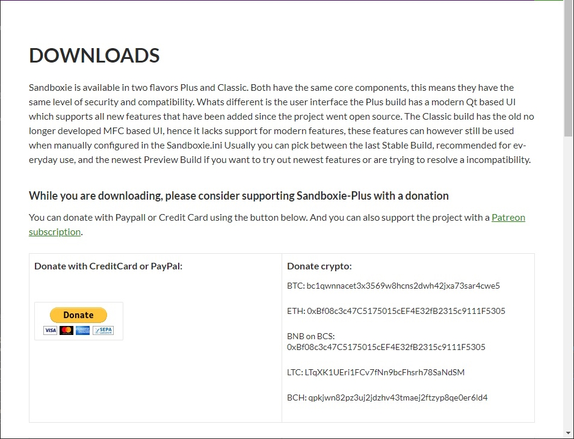
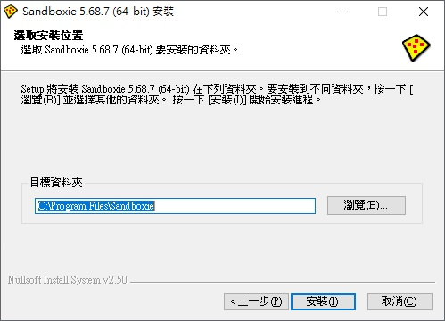
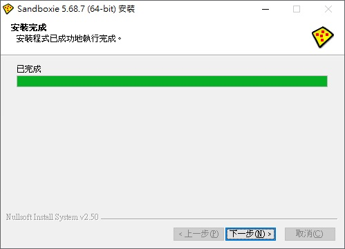
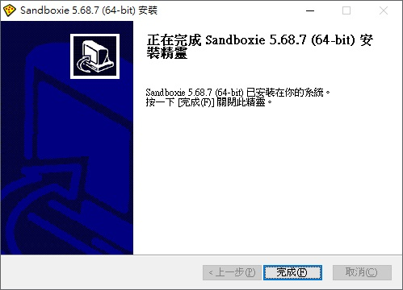
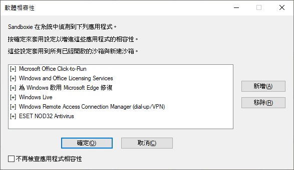
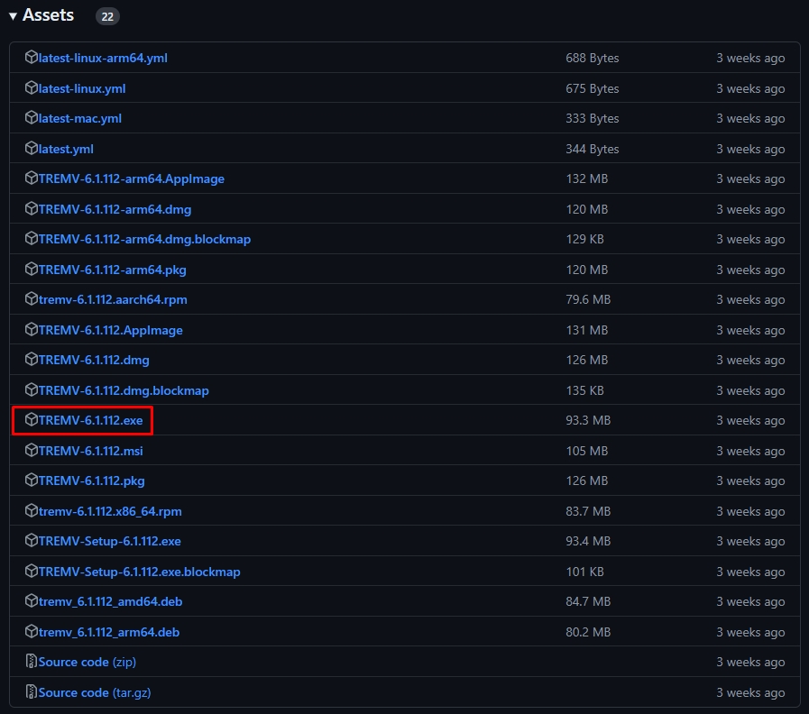
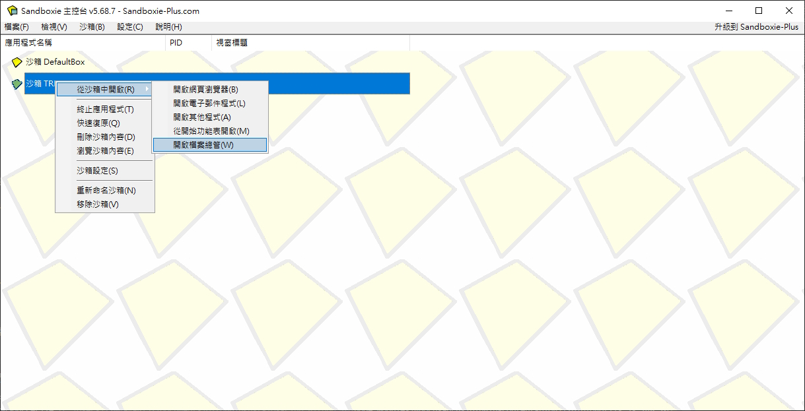

:::tip

本教學使用「Sandboxie-Classic-x64-v5.68.7」、「TREMV-6.1.112」示範 。

:::

## Sandboxie 前的準備

### 下載

#### 第 1 步

先到官網下載頁面 [Sandboxie](https://sandboxie-plus.com/downloads/) 。

#### 第 2 步

看到「Sandboxie-Classic Downloads」選擇對應自己電腦的系統版本。

### 安裝

#### 第 3 步

把安裝程式打開，進行安裝。

點選 我接受 。

:::caution

如果不同意協議條款請停止安裝！

:::

#### 第 4 步

點選 安裝 。

:::tip

選擇預設安裝路徑即可，如果有需要再變更其他安裝路徑位置。

:::

#### 第 5 步

安裝完成後點選 `下一步` 。

#### 第 6 步

接著安裝驅動程式核心，點選 下一步 。

#### 第 7 步

點選 完成 。

## 開始使用 Sandboxie

#### 第 8 步

開啟 Sandboxie 應用程式。

:::tip

在部分電腦可能會出現「軟體相容性」視窗，直接點選確定即可。

:::

### 新增沙箱。

#### 第 9 步

方式: 沙箱 -> 建立新沙箱

#### 第 10 步

輸入沙箱名稱，輸入完成後點選 確定 。

### 下載 TREMV

#### 第 11 步

進入 TREMV 的 [GitHub Releases](https://github.com/yayacat/TREM/releases) 網頁。

下載 TREMV-6.1.112.exe 項目。

:::tip

下載「軟體執行檔」，並非軟體安裝檔。

:::

### 設定沙箱

#### 第 12 步

回到 Sandboxie ，左鍵點選剛剛新增的沙箱後，右鍵選擇「沙箱設定」。

#### 第 13 步

進入左側「檔案遷移」項目後，在右側輸入「1024000」，再點選確定。

### 完成設定

#### 第 14 步

左鍵點選剛剛新增的沙箱後，右鍵選擇「從沙箱中開啟->開啟檔案總管」。

檔案總管開啟後再關閉檔案總管。

#### 第 15 步

左鍵點選剛剛新增的沙箱後，右鍵選擇「瀏覽沙箱內容」。

#### 第 16 步

把剛剛下載的 TREMV 軟體執行檔放到 user 資料夾裡面，並快點 2 下執行軟體。

## 結果

#### 第 17 步

這樣就完成了！

