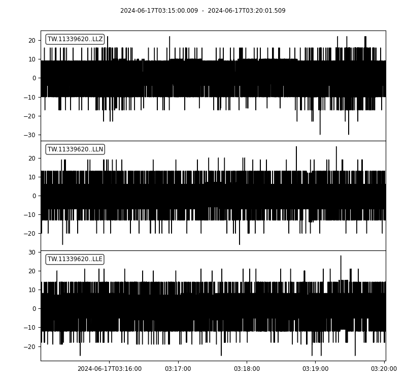
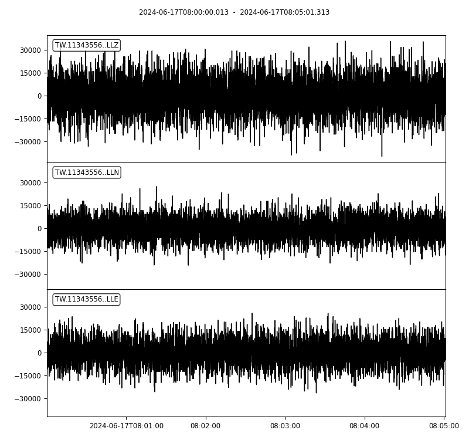
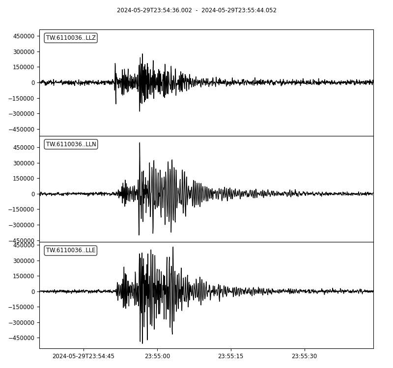
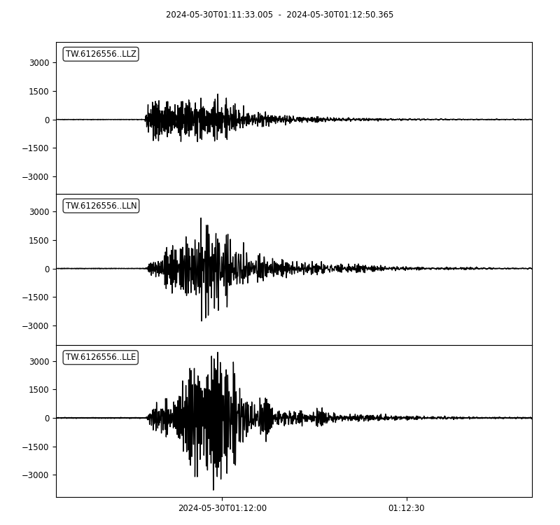
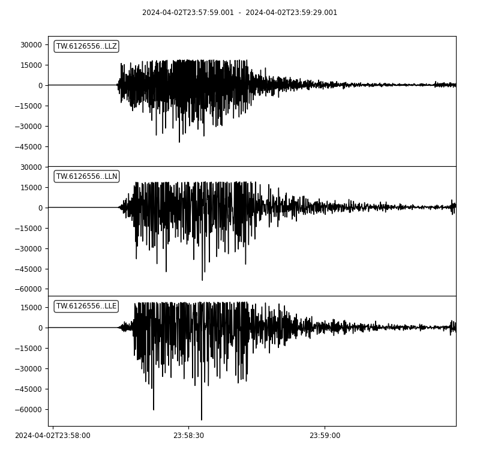
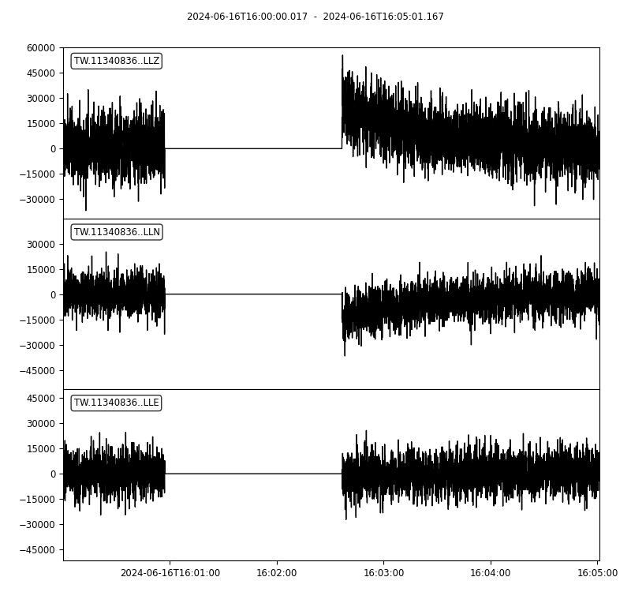
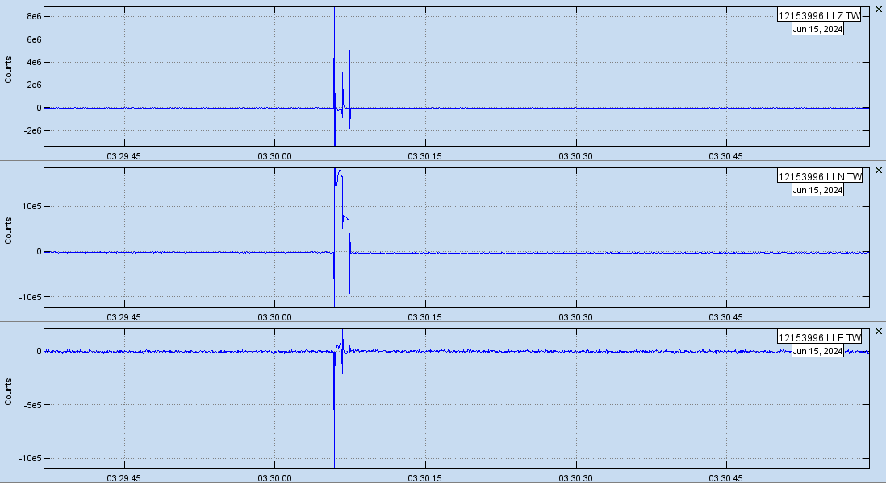
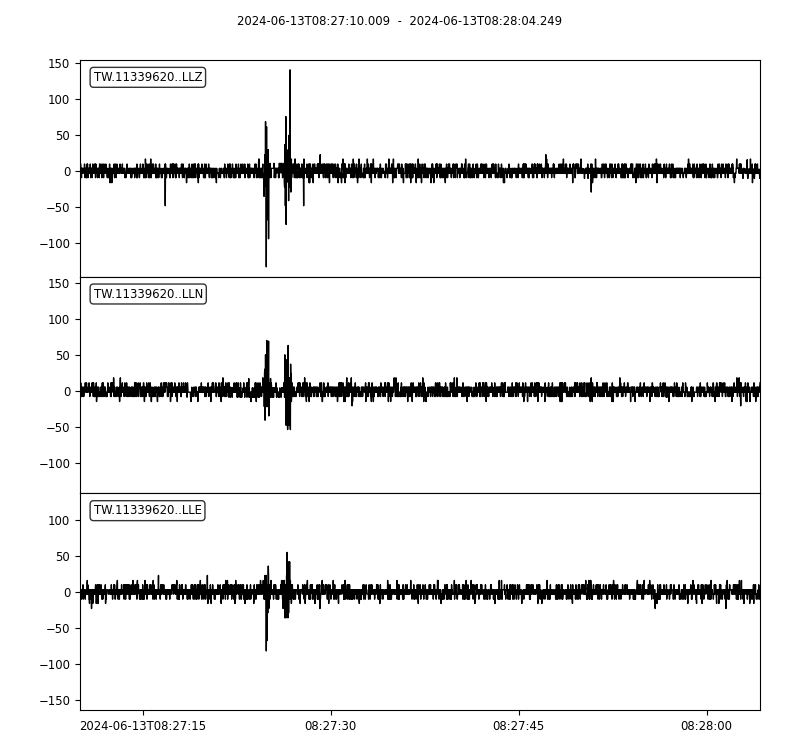
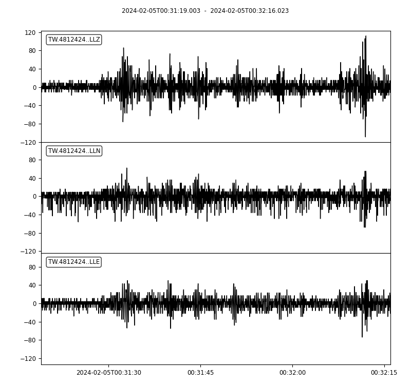

## 介紹

我們有建置自己的地震觀測網，並把地震儀器裝置放到各地地方。

TREM 觀測網有分「MS-Net」以及「SE-Net」。

:::tip

MS-Net ：速度儀，可以觀測到微小的晃動。

SE-Net ：加速度儀，可以觀測到有感的地震晃動。

:::

這是 MS-Net 的地震觀測站放置後的閒置觀測波形圖。

這是 Se-Net 的地震觀測站放置後的閒置觀測波形圖。

:::tip

圖片上面有 3 軸波形資料：

Z 軸觀測垂直向。

N 軸觀測南北向。

E 軸觀測東西向。

:::

:::tip

3 軸顯示介面依照波形最大數值當作最大顯示介面。

:::

## 波形

### 地震檢測波形

這是 se-net 地震觀測站，在地震當下所檢測到的波形圖，震度 4 級。

這是 ms-net 地震觀測站，在地震當下所檢測到的波形圖，震度 3 級。

:::info

我們用的 ms-net 地震觀測站使用的儀器有飽和上的限制，最大只能測到 4 級震度。

:::

### 其他波形說明

測站在重啟完成後，一開始會需要一些時間進行校正。(中間一條直線是測站離線無資料狀態)

我們放置的測站是在各地民眾的家裡，可能會有(誤)觸碰、環境影響干擾等狀況，以下是在我們得知檢測到的其他狀況說明。

這是有民眾不小心碰到測站裝置所觀測到的波形。

這是有民眾的家附近遭到環境干擾，汽車排氣管所觀察到的波形(民眾回報的說明)。

這是有民眾的家附近遭到環境干擾，施工觀察到的波形(民眾回報的說明)。

## 相關連結

[地震資料管理系統(SDMS)](https://api.exptech.com.tw/file/SDMS.html)