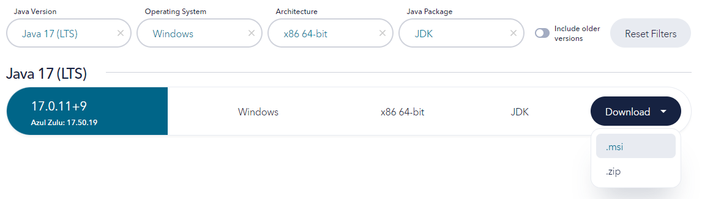
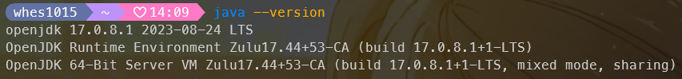

## 安裝 [Java SDK](https://www.azul.com/downloads/?version=java-17-lts&os=windows&architecture=x86-64-bit&package=jdk#zulu)


# 安裝 [Clink](https://github.com/chrisant996/clink/releases)

# 安裝 [Oh My Posh](https://ohmyposh.dev/)
```sh
winget install JanDeDobbeleer.OhMyPosh -s winget
```
### 字體
```sh
oh-my-posh.exe font install
```
### 搭配 Clink
C:\Program Files (x86)\clink\oh-my-posh.lua

:::caution

請替換換成自己的 Config json 路徑

:::
```
load(io.popen('oh-my-posh init cmd --config C:/Users/使用者/Documents/oh-my-posh.json'):read("*a"))()
```


# 安裝 [Flutter SDK](https://docs.flutter.dev/get-started/install/windows/mobile?tab=download)
### 解壓縮
- 把 Zip 解壓縮
### 環境變數
打開電腦的設定 >> 系統 >> 進階系統設定 >> 進階 >> 環境變數 >> 